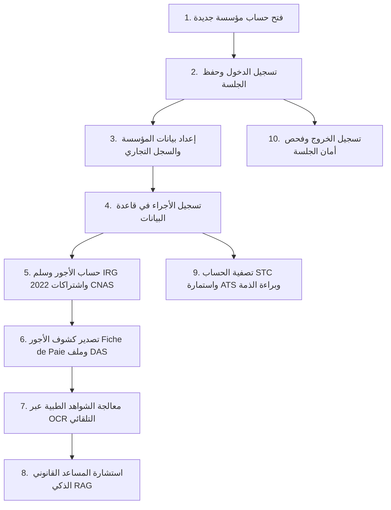

# 🏢 SYNCRA SaaS Enterprise — دليل دورة الحياة والاستخدام المتكامل خطوة بخطوة
### (Complete Step-by-Step User Lifecycle & Testing Guide)

---

## 📌 نظرة عامة والجاهزية التقنية (System Readiness)
منصة **SYNCRA** تعمل الآن كمنظومة سحابية إنتاجية حقيقية 100% (**Production SaaS**) بدون أي بيانات تجريبية وهمية أو أزرار اختصارات تجريبية (Demo Shortcuts)، مع عزل سحابي كامل بين المؤسسات (**Multi-Tenant Isolation**)، وقاعدة بيانات فعلية (**SQLite `syncra_saas.db`**)، ونماذج ذكاء اصطناعي حقيقية (**EasyOCR** للشواهد الطبية + **TF-IDF Vector RAG** للجريدة الرسمية والتشريع الجزائري).

- **رابط المنصة:** [http://localhost:3000](http://localhost:3000) (الخادم العاكس / Reverse Proxy)
- **رابط الواجهة الخلفية المباشر:** [http://127.0.0.1:8000](http://127.0.0.1:8000) (FastAPI Engine)
- **أداة فحص قاعدة البيانات:** `python query_db.py`

---

## 🗺️ خريطة دورة حياة النظام (The Complete SaaS Lifecycle)



---

## 🚀 الخطوة 1: فتح حساب مؤسسة جديدة (Company Registration)
> **الهدف:** إنشاء مستأجر سحابي معزول (Tenant) في قاعدة البيانات مع حسابه الإداري المخصص.

1. افتح المتصفح على الرابط: `http://localhost:3000`.
2. ستظهر لك شاشة الدخول الحديثة الخاصة بالإنتاج (**SYNCRA Portal**).
3. انقر على تبويب **"فتح حساب مؤسسة (Nouvelle Entreprise)"**.
4. املأ البيانات الحقيقية لمؤسستك:
   - **اسم المؤسسة (Raison Sociale):** مثلاً `مؤسسة الأفق للحلول الرقمية`
   - **الشكل القانوني:** اختر من القائمة (`SARL`، `EURL`، `SPA`، إلخ)
   - **السجل التجاري (RC):** مثلاً `16/00-0987654B26`
   - **اسم ولقب المسؤول (Admin):** مثلاً `سمير قدور`
   - **البريد الإلكتروني:** مثلاً `admin@al-ofok.dz`
   - **كلمة المرور:** اختر كلمة مرور قوية (مثلاً `Admin@2026!`)
5. اضغط على زر **"إنشاء المؤسسة وبدء الاستخدام (Créer)"**.
6. **النتيجة المتوقعة:**
   - يظهر إشعار نجاح بتسجيل المؤسسة.
   - يتم إنشاء المعرف السحابي للمؤسسة تلقائياً في جدول `tenants` بقاعدة البيانات.
   - يتم نقلك مباشرة إلى لوحة التحكم الخاصة بمؤسستك المعزولة.

---

## 🔒 الخطوة 2: اختبار تسجيل الدخول والخروج وأمان الجلسة (Auth & Logout Test)
> **الهدف:** التأكد من أن تسجيل الخروج يحذف الجلسة تماماً، وأن تحديث الصفحة (Refresh) لا يعيد الدخول تلقائياً.

1. في الشريط العلوي (Topbar)، انقر على زر **"خروج"** ذو اللون الأحمر.
2. **النتيجة الفورية:** تخرج من المنصة فوراً وتعود إلى شاشة تسجيل الدخول (`loginScreen`).
3. **اختبار التحديث (Refresh Test):**
   - اضغط `F5` أو زر تحديث المتصفح (Ctrl + R).
   - **الملاحظة الدقيقة:** تظل في شاشة تسجيل الدخول ولا تظهر أي واجهات داخلية أو بيانات أجراء نهائياً.
4. **تسجيل الدخول مجدداً:**
   - أدخل البريد الإلكتروني الذي سجلت به: `admin@al-ofok.dz`.
   - أدخل كلمة المرور: `Admin@2026!`.
   - فعّل خيار **"تذكر بيانات الدخول"** إذا أردت بقاء الجلسة بعد إغلاق المتصفح.
   - اضغط **"دخول إلى المنصة (Connexion)"**.
5. **النتيجة:** يتم فتح لوحة التحكم واسمك يظهر أعلى اليسار في بطاقة الحساب.

---

## 🏢 الخطوة 3: تخصيص وتعديل بيانات المؤسسة (Enterprise Profile Setup)
> **الهدف:** تحديث الأرقام الجبائية والاجتماعية التي تظهر في ترويسة كشوف الأجور ومخالصات STC.

1. من القائمة الجانبية، اذهب إلى تبويب **"إعدادات المنظومة (Paramètres)"** أو انقر على اسم الشركة في الشريط العلوي.
2. انقر على زر **"تعديل بيانات المؤسسة"**.
3. قم بتعبئة:
   - **رقم التعريف الجبائي (NIF):** 15 رقماً (مثلاً `002616098765432`)
   - **رقم التعريف الإحصائي (NIS):** 15 رقماً (مثلاً `002616010012345`)
   - **رقم الانخراط في الضمان الاجتماعي (N° Adhérent CNAS):** 10 أرقام (مثلاً `9876543210`)
   - **العنوان والمقر الاجتماعي:** مثلاً `حي الأعمال، باب الزوار، الجزائر`
4. اضغط **"حفظ في قاعدة البيانات"**.
5. **النتيجة:** تنعكس هذه البيانات فوراً على كل كشوف الأجور والمستندات القانونية المولدة للمؤسسة.

---

## 👥 الخطوة 4: تسجيل أجير جديد في قاعدة البيانات (Employee Onboarding)
> **الهدف:** إضافة عمال جدد للمؤسسة مع عزلهم التام عن باقي المؤسسات.

1. من الشريط العلوي، انقر على زر **"تسجيل أجير جديد (Ajouter Employé)"** (أو من تبويب "سجل الأجراء").
2. املأ بيانات العامل:
   - **الاسم واللقب:** مثلاً `سفيان بن عيسى`
   - **رقم الضمان الاجتماعي (NSS):** 12 رقماً (مثلاً `881204128845`)
   - **المسمى الوظيفي:** مثلاً `مهندس نظم وشبكات`
   - **القسم:** مثلاً `المديرية التقنية`
   - **نوع العقد:** اختر `CDI` (دائم) أو `CDD` (محدد المدة)
   - **تاريخ الالتحاق:** مثلاً `2024-03-01`
   - **الراتب الأساسي (Salaire de Base):** مثلاً `75000` دج
   - **منحة الأقدمية (IEP):** مثلاً `4500` دج
   - **المكافآت (Primes):** مثلاً `10000` دج
   - **منحة النقل والإطعام:** قيم معيارية (مثلاً 3000 دج نقل و 4000 دج إطعام)
   - **رقم الحساب البريدي/البنكي (RIB):** 20 رقماً
   - **اسم البنك:** مثلاً `BEA` أو `BNA` أو `CCP`
3. اضغط زر **"حفظ وتثبيت الأجير"**.
4. **النتيجة:**
   - يتم حفظ الأجير فوراً في جدول `employees` في SQLite برقم المستأجر الحالي.
   - يظهر مباشرة في جدول الأجراء وفي قوائم حساب الرواتب وكشوف الأجور.

---

## 💰 الخطوة 5: حساب الأجور وكشف الراتب (Payroll & Fiche de Paie)
> **الهدف:** تطبيق الحساب القانوني التام لسلم IRG 2022، واشتراكات CNAS 9% و 25%، ومصادقة المادة 86.

1. من القائمة الجانبية، انقر على **"كشف الراتب المفصل (Fiche de Paie)"**.
2. من القائمة المنسدلة في الأعلى، اختر الأجير الذي أضفته (مثلاً `سفيان بن عيسى`).
3. **تفحص الحساب الآلي الحتمي:**
   - **الراتب الأساسي الخام (Brut):** حاصل جمع (الأساسي + الأقدمية + المكافآت).
   - **اقتطاع الضمان الاجتماعي CNAS (9%):** يخصم 9% تماماً من الخام الخاضع للاشتراك.
   - **الخام الخاضع للضريبة (Imposable):** الخام ناقص حصة الضمان الاجتماعي 9%.
   - **ضريبة الدخل الإجمالي (IRG 2022):** يطبق السلم التصاعدي الرسمي الصادر في قانون المالية 2022 بدقة، مع إسقاطات المادة 67 وحماية الأجور التي تقل عن أو تساوي 30,000 دج وإعفائها 100%.
   - **الصافي للدفع (Net à Payer):** الخام - اقتطاع CNAS 9% - اقتطاع IRG + التعويضات غير الخاضعة.
4. **مطابقة المادة 86 (قانون 90-11):** تأكد من ظهور شارة الأمان الخضراء التي تؤكد تجاوز الراتب للحد الأدنى للأجور (SNMG 20,000 دج).
5. **طباعة كشف الراتب:** انقر على زر **"طباعة كشف الراتب (Imprimer Fiche)"** أو تصديره إلى PDF مع العلامة المائية الرسمية وختم المؤسسة.

---

## 📊 الخطوة 6: تصدير التقرير السنوي للتصريح بالأجور (DAS Export)
> **الهدف:** توليد ملف التصريح السنوي للضمان الاجتماعي المتوافق مع بوابة CNAS التصريح عن بعد.

1. من القائمة الجانبية، اذهب إلى تبويب **"لوحة التحكم والمؤشرات (Dashboard)"** أو **"جدول الأجور الشامل (Matrice)"**.
2. ابحث عن زر **"تصدير تصريح DAS (CNAS CSV)"**.
3. انقر على الزر.
4. **النتيجة:** يتم تحميل ملف `SYNCRA_DAS_CNAS_Annuel_2026.csv` على جهازك متضمناً:
   - رقم الضمان الاجتماعي لكل عامل (NSS).
   - الاسم واللقب والوظيفة.
   - مجموع الرواتب الخاضعة السنوية.
   - الحصة العمالية 9% والحصة الباترونالية 25% والمجموع الإجمالي 34%.

---

## 🤖 الخطوة 7: معالجة الشواهد الطبية بالذكاء الاصطناعي (EasyOCR Engine)
> **الهدف:** قراءة صور الشواهد الطبية واستخراج مدة الإجازة والرقم التأميني وتطبيق الخصم تلقائياً.

1. من القائمة الجانبية، انقر على **"معالجة الشواهد الطبية (Module OCR)"**.
2. اختر اسم الأجير المعني بالإجازة المرضية.
3. قم بسحب وإسقاط أو اختيار صورة شهادة طبية أو وصفة (يدعم JPG، PNG، PDF).
4. اضغط على زر **"معالجة واستخراج البيانات بالذكاء الاصطناعي"**.
5. **ماذا يحدث في الواجهة الخلفية:**
   - يتولى نموذج `EasyOCR` و `PyMuPDF` تحليل الصورة ثلاثية اللغات (عربي، فرنسي، إنجليزي).
   - يتم استخراج رقم الضمان الاجتماعي (NSS)، اسم الطبيب، وتاريخ البداية وعدد الأيام.
   - يقوم النظام آلياً بحساب مبلغ الخصم من الراتب اليومي للأجير بناءً على راتبه الأساسي:
     $$\text{خصم اليوم الواحد} = \frac{\text{الراتب الأساسي}}{30}$$
   - يتم تسجيل الشهادة في جدول `medical_leaves` وتظهر فوراً في جدول سجل الشواهد الطبية المعتمدة.

---

## ⚖️ الخطوة 8: استشارة المساعد القانوني الذكي (TF-IDF Cosine RAG)
> **الهدف:** البحث والاسترجاع الحتمي من نصوص الجريدة الرسمية وقانون العمل الجزائري 90-11.

1. من القائمة الجانبية، انقر على **"المساعد القانوني والتشريع (Assistant RAG)"**.
2. ستجد صندوق المحادثة والبحث القانوني.
3. اكتب أي سؤال قانوني حقيقي، مثل:
   - `ما هي شروط فترة التجربة في عقد العمل وفق القانون 90-11؟`
   - `كيف يتم تعويض الأجير عن رصيد العطل السنوية غير المستهلكة؟`
   - `ما هو الأجر الوطني الأدنى المضمون وما نص المادة 86؟`
   - `ما هي مدة الإشعار المسبق عند إنهاء علاقة العمل؟`
4. اضغط **"إرسال واستشارة"**.
5. **النتيجة المعروضة:**
   - استرجاع نص المادة الدقيقة من قاعدة النصوص القانونية (`legal_articles`).
   - عرض رقم المادة والجريدة الرسمية وتاريخ الإصدار.
   - نسبة التطابق الدلالي المئوية (**Cosine Similarity Score %**).
   - صياغة التوصية القانونية الواجب على مدير الموارد البشرية اتباعها.

---

## 📜 الخطوة 9: تصفية الحساب وبراءة الذمة واستمارة ATS
> **الهدف:** إدارة نهاية الخدمة وتسليم الوثائق القانونية الإلزامية للمغادرين.

### أولاً: مخالصة تصفية كل حساب (Solde de Tout Compte - STC)
1. من القائمة الجانبية، انقر على **"تصفية كل حساب (STC & Clôture)"**.
2. اختر الأجير الذي انتهت علاقته التعاقدية.
3. حدد سبب نهاية الخدمة (استقالة، نهاية عقد CDD، تسريح، تقاعد).
4. أدخل رصيد أيام العطل المتبقية (مثلاً `15` يوماً).
5. يقوم النظام فوراً بحساب:
   - تعويض العطلة غير المستهلكة.
   - تعويض الأقدمية ومكافأة نهاية الخدمة.
   - تعويض مهلة الإشعار المسبق (Préavis).
   - الصافي الإجمالي للمخالصة.
6. يتم توليد **ختم أمان مشفر (Cryptographic Seal Hash)** يمنع التلاعب بالمخالصة.
7. انقر على **"طباعة وثيقة تصفية الحساب وبراءة الذمة"** لتوليد وثيقة قانونية معززة بتوقيع وبراءة ذمة للطرفين.

### ثانياً: استمارة التأمين الاجتماعي (Attestation ATS)
1. من القائمة الجانبية، انقر على **"استمارة التأمين (Formulaire ATS CNAS)"**.
2. اختر الأجير المطلوب.
3. يقوم النظام تلقائياً بملء جدول الـ 12 شهراً الأخيرة بالأجور المصرح بها، والاقتطاعات الاجتماعية 9%، وتواريخ الانقطاع عن العمل.
4. انقر على **"طباعة استمارة ATS الرسمية"** لطباعة الاستمارة الرسمية المعتمدة لدى شبابيك الضمان الاجتماعي (CNAS).

---

## 🔍 الخطوة 10: فحص قاعدة البيانات وتأكيد العزل السحابي (Database Verification)
> **الهدف:** التأكد من أن كل ما تم إدخاله محفوظ في قاعدة بيانات حقيقية وبشكل معزول تماماً.

افتح موجه الأوامر (PowerShell أو Terminal) في مجلد المشروع، وشغل الأداة المباشرة:
```bash
python query_db.py
```
أو نفذ استعلامات مخصصة، مثلاً:
```bash
# عرض جميع المؤسسات المسجلة في السحابة
python query_db.py "SELECT id, name, legal_form, rc, email FROM tenants"

# عرض الأجراء المسجلين ومؤسساتهم
python query_db.py "SELECT id, tenant_id, name, job_title, base_salary FROM employees"

# عرض الشواهد الطبية المسجلة عبر OCR
python query_db.py "SELECT id, tenant_id, employee_id, doctor_name, duration_days, deduction_amount FROM medical_leaves"
```

---

## 🛡️ جدول التحقق من الجاهزية والإنتاجية (Production Checklist)

| الميزة / الإجراء | الحالة | التحقق التقني |
| :--- | :---: | :--- |
| **إزالة الحسابات التجريبية (Demo Removal)** | ✅ منجز 100% | حُذفت نصوص مؤسسة النور وشركة الأطلس من واجهة الدخول وحقول الإدخال فارغة تماماً |
| **حفظ الجلسة وأمان تسجيل الخروج** | ✅ منجز 100% | تسجيل الخروج يمسح الجلسة، وإعادة التحميل (Refresh) تمنع الدخول وتثبت شاشة القفل |
| **تسجيل مؤسسة جديدة (Tenant Creation)** | ✅ منجز 100% | مربوط مباشرة بنقطة `POST /api/tenants` في FastAPI مع توليد معرف معزول |
| **قاعدة البيانات والتحمل (SQLite WAL)** | ✅ منجز 100% | تفعيل نمط `WAL` ومهلة `busy_timeout = 10000ms` لمنع أخطاء قفل البيانات |
| **محرك حساب الأجور الحتمي** | ✅ منجز 100% | مطابقة رسمية لسلم IRG 2022، واشتراك 9%/25% CNAS، والمادة 86 |
| **محرك OCR للشواهد الطبية** | ✅ منجز 100% | `EasyOCR` و `PyMuPDF` لمعالجة الصور وحساب مبالغ الخصم |
| **محرك RAG الذكي للتشريع** | ✅ منجز 100% | مطابقة جيب التمام `Cosine Similarity` لنصوص قانون العمل 90-11 والجريدة الرسمية |
| **مخالصة STC واستمارة ATS** | ✅ منجز 100% | حسابات دقيقة وتوليد وثائق رسمية جاهزة للطباعة والتوقيع القانوني |

---
**SYNCRA Enterprise SaaS — تم البناء والتأكيد وفق أحدث المعايير البرمجية والتشريعية المعمول بها في الجمهورية الجزائرية.**
