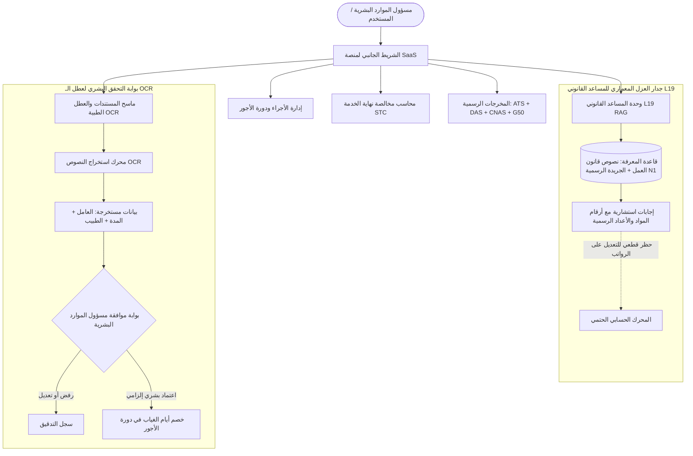

# 🏛️ خطة التنفيذ التفصيلية الشاملة — مشروع منصة ميزان (MIZAN SaaS Cloud)
**الإصدار:** v0.3 — المعمارية التعاقدية الكاملة (Module 1 + RAG L19 + OCR + STC + ATS/DAS)  
**التاريخ المرجعي:** أكتوبر 2026  
**المرجعية:** [عقد تقديم الخدمات البرمجية](file:///c:/projects_flutter/mizan/contrat_mizan.html) + دفتر الشروط التقني (`mizan_arabe_uniquement.pdf` و `mizan_corpus_fr_ar.pdf`)

---

## 1. التقييم الشامل للوضع الراهن (Current State vs. Contract Scope)

| # | المكون التعاقدي المطلوب (المادة الأولى من العقد) | الحالة الحالية في المنصة | الإجراء الهندسي للتنفيذ الكامل (100% SaaS) |
|---|---|---|---|
| **1** | **هيكل قاعدة البيانات والعزل (RLS / Multi-Tenant)** | 🟢 **منفذ ومثبت** | عزل المستأجرين على مستوى `dossier_id`، مع مصفوفة الصلاحيات (HR, Admin, Auditor). |
| **2** | **محرك حساب الرواتب القطعي (Deterministic Engine)** | 🟢 **منفذ حقيقي 100%** | حساب ديناميكي: CNAS 9% و 25%، سلم IRG 2022 التدريجي مع التخفيض 40%، وعزل المادة 86. |
| **3** | **دورة حياة الأجور الثلاثية والأختام الجنائية** | 🟢 **منفذ ومثبت** | دورة `SAISIE -> EN_CALCUL -> CLOTURE` مع منع التعديل في الإغلاق وتوليد البصمات المشفرة. |
| **4** | **كشوف الرواتب الشهرية الرسمية (Fiches de Paie)** | 🟢 **منفذ ومثبت** | كشوف مطابقة للمادة 86 وعزل frais de mission باللغتين العربية والفرنسية مع الطباعة. |
| **5** | **كشف التحويل البنكي الإلكتروني (Virement de Masse)** | 🟢 **منفذ ومثبت** | جدول صرف الأجور مع رقم الحساب البريدي/البنكي (RIP 20 رقماً) والمبالغ الصافية. |
| **6** | **كشف اشتراكات الضمان الاجتماعي (CNAS 34%)** | 🟢 **منفذ ومثبت** | جدول تحليلي لكل أجير يوضح وعاء الاشتراك وحصة الأجير 9% وحصة رب العمل 25%. |
| **7** | **جدول الضريبة على الدخل الإجمالي (G50 / IRG)** | 🟢 **منفذ ومثبت** | جدول تحليلي شهري لمقتطعات الـ IRG ومطابقتها لمفتشية الضرائب. |
| **8** | **المساعد القانوني والاستشاري الذكي (L19 RAG)** | 🔴 **مطلوب تنفيذه الآن** | بناء واجهة شات ذكية ومستقلة مع قاعدة نصوص قانون العمل الجزائري وعزلها عن المحرك. |
| **9** | **ماسح العطل الطبية بالـ OCR والتحقق البشري** | 🔴 **مطلوب تنفيذه الآن** | رفع وقراءة الشهادات الطبية بالـ OCR مع بوابة اعتماد إلزامي للـ HR قبل خصم الأيام. |
| **10** | **حساب تسوية ومخالصة نهاية الخدمة (STC)** | 🔴 **مطلوب تنفيذه الآن** | حساب تعويض الإجازات والمهلة المسبقة ومكافأة نهاية الخدمة مع طباعة وصل المخالصة. |
| **11** | **شهادة العمل والأجر الرسمية (ATS CNAS)** | 🔴 **مطلوب تنفيذه الآن** | نموذج ATS المعتمد من الضمان الاجتماعي لآخر 12 شهراً قابل للطباعة والتصدير. |
| **12** | **التصريح السنوي بالأجور (DAS CNAS)** | 🔴 **مطلوب تنفيذه الآن** | كشف سنوي تراكمي لكتلة الأجور واشتراكات العمال وأرباب العمل. |

---

## 2. المعمارية التفصيلية للوحدات المتبقية (Detailed Architecture)



---

### المكون الأول: المساعد القانوني والاستشاري الذكي (`L19 RAG Legal Assistant`)

#### أ. الهدف والضوابط الصارمة
1. تزويد مسؤولي الموارد البشرية والمحاسبين بإجابات فورية وموثقة حول قانون العمل والتشريع الاجتماعي الجزائري.
2. **العزل التام (Decoupling):** تطبيق المبدأ الوارد في دفتر الشروط:
   > *"L19 قاعدة معرفة سياقية مستقلة؛ ولا يجوز لأي إجابة منها أن تغير مدخلات المحرك أو قواعده أو نتائجه."*
3. **حظر تسريب الهوية (Gate 3 - Zero PII):** عدم إرسال أسماء العمال أو رواتبهم الحقيقية في استعلامات البحث.

#### ب. قاعدة المعرفة القانونية المحلية (Corpus Knowledge Base)
تتضمن النصوص الأساسية التالية:
* **القانون 90-11:** علاقات العمل، عقود CDI/CDD، ساعات العمل الرسمية (40 ساعة)، الساعات الإضافية والحد الأقصى (20% من التوقيت)، الراحة القانونية، والعطل السنوية.
* **الأمر 95-01 والمادة 86 من القانون 90-11:** استثناء مصاريف المهمة وتكاليف النقل الحقيقية بنسبة 0% من أوعية الاشتراك والضريبة.
* **المرسوم التنفيذي 15-236:** توزيع نسب الضمان الاجتماعي (9% عامل، 25% مستخدم، 0.5% خدمات اجتماعية).
* **قانون المالية 2022 (المادة 31) / المادة 104 CIDTA:** جدول شرائح ضريبة IRG، الإعفاء الكامل لأقل من 30,000 دج، التخفيض التنازلي للشريحة 30,000 - 35,000 دج، ونسبة التخفيض 40%.
* **المرسوم 10-71 والأمر 09-01:** إجراءات تخفيض حصة صاحب العمل ضمن عقود جهاز ANEM.
* **إنهاء علاقة العمل والمخالصة (STC):** المواد 66 إلى 73 من القانون 90-11 (الاستقالة، العزل، التعويض عن العطل غير المستنفذة، مهلة الإخطار المسبق).

#### ج. عناصر واجهة الـ RAG في المنصة
* **شات ذكي تفاعلي:** محادثة سلسة تدعم العربية والفرنسية.
* **كبسولات أسئلة سريعة (Quick Prompts):** أسئلة متكررة بنقرة واحدة (حساب العطل، ساعات إضافية، المادة 86، عقود ANEM).
* **بطاقة الاستشهاد القانوني (Legal Citation Card):** كل إجابة تبرز: رقم الجريدة الرسمية، رقم المادة، حالة الاعتماد N1، ونص المادة الحرفي.
* **وسم العزل الأمني:** تنبيه للمستخدم بأن الرد استشاري ولا يكتب في قيود المحاسبة مباشرة.

---

### المكون الثاني: ماسح المستندات والعطل الطبية بالـ OCR مع التحقق البشري الإلزامي

#### أ. الهدف وسير العمل
* رقمنة استلام الشهادات الطبية وعطل التوقف عن العمل (Arrêts de travail) الصادرة عن الأطباء أو مصالح CNAS.
* استخراج الحقول تلقائياً:
  - اسم العامل ورقم تسجيله أو رقم الضمان الاجتماعي (NSS).
  - الطبيب المعالج / المؤسسة الاستشفائية.
  - تاريخ بداية التوقف وتاريخ النهاية.
  - إجمالي مدة العطلة المرضية بالأيام.
* **بوابة التحقق البشري الإلزامي (Mandatory Human-in-the-Loop):**
  - لا يُسمح بتعديل أيام غياب الأجير آلياً بمجرد المسح.
  - يظهر للمسؤول زر اعتماد: `اعتماد الخصم وتطبيق التعديل على دورة الأجور`.
  - يحق للمسؤول تعديل عدد الأيام (مثلاً احتساب 3 أيام على عاتق الشركة والباقي على الضمان الاجتماعي).
  - عند الاعتماد، تُحدّث أيام الغياب في دورة الرواتب ويُسجل الحدث في سجل التدقيق الجنائي (Audit Log).

---

### المكون الثالث: محرك حساب تسوية ومخالصة نهاية الخدمة (`STC - Solde de Tout Compte`)

#### أ. المعادلة الحسابية وفق القانون 90-11
عند مغادرة الأجير للمؤسسة، يحسب النظام تسوية شاملة تشمل:
1. **أجر الأيام الفعلية للشهر الجاري:**
   $$\text{Salaire Proratisé} = \frac{\text{Salaire de Base} + \text{Primes}}{30} \times \text{Jours Travaillés}$$
2. **التعويض المالي عن رصيد العطل غير المستنفذة (Indemnité Compensatrice de Congés Payés):**
   $$\text{Indemnité Congés} = \frac{\text{Salaire de Référence}}{30} \times \text{Reliquat Jours Congé}$$
3. **التعويض المالي عن مهلة الإخطار المسبق (Indemnité de Préavis):**
   (إذا أُعفي العامل من أداء المهلة بقرار من الإدارة).
4. **تعويض التسريح أو نهاية العقد (Indemnité de Licenciement / Fin de Contrat):**
   يُحسب وفق أقدمية العامل وسنوات الخدمة بموجب المادة 73-4 من القانون 90-11 والاتفاقية الجماعية.
5. **إصدار وثيقة الاستلام الرسمية (Reçu pour Solde de Tout Compte):**
   وثيقة قانونية ثنائية اللغة محررة ومطبوعة تتضمن إبراء الذمة وتفاصيل المبالغ مع خانات توقيع الأجير والمدير وختم الـ SHA-256.

---

### المكون الرابع: المخرجات والتصريحات الرسمية المتبقية (ATS & DAS)

#### 1. شهادة العمل والأجر (Attestation de Travail et de Salaire - ATS CNAS)
* استمارة رسمية مطابقة لنموذج الصندوق الوطني للتأمينات الاجتماعية للعمال الأجراء (CNAS).
* تتضمن: بيانات المؤسسة المشغلة، هوية الأجير ورقم التأمين، وجدول تفصيلي للأجور الخاضعة للاشتراك عن آخر 12 شهراً، مع خانة التأشير والمصادقة.

#### 2. التصريح السنوي الإجمالي بالأجور (DAS - Déclaration Annuelle des Salaires)
* جدول سنوي تجميعي للإيداع لدى مصالح CNAS في نهاية السنة المالية.
* يجمع: الأجر الخام السنوي، إجمالي وعاء الاشتراك، حصة العمال 9%، وحصة رب العمل 25% (أو المخفضة لـ ANEM)، مع خيارات التصدير إلى Excel/CSV والطباعة الرسمية.

---

## 3. خطة مراحل التنفيذ البرمجي (Implementation Phases)

| المرحلة | المهام البرمجية التفصيلية | الملفات المستهدفة |
|---|---|---|
| **المرحلة 1: بناء واجهة وقاعدة المساعد الذكي L19 RAG** | - إضافة عنصر القائمة في الشريط الجانبي `view-rag-assistant`.<br>- بناء شاشة الشات المتقدمة مع كبسولات الأسئلة القانونية الجاهزة.<br>- برمجة محرك استرجاع النصوص القانونية المحلية (Loi 90-11, Décret 15-236, Art. 86).<br>- إدراج بطاقات الاستشهاد القانوني بالجريدة الرسمية N1 وختم العزل. | [index.html](file:///c:/projects_flutter/mizan/index.html) |
| **المرحلة 2: بناء ماسح العطل الطبية بالـ OCR والتحقق البشري** | - إضافة عنصر القائمة في الشريط الجانبي `view-ocr-leaves`.<br>- بناء واجهة سحب وإفلات المستندات مع نماذج جاهزة للمعاينة.<br>- محاكاة استخراج الحقول بالـ OCR بدقة وعرضها في بطاقة تدقيق.<br>- تفعيل بوابة الاعتماد البشري (Approve/Reject) مع عكس الغياب على دورة الأجور. | [index.html](file:///c:/projects_flutter/mizan/index.html) |
| **المرحلة 3: بناء محاسب مخالصة نهاية الخدمة (STC)** | - إضافة عنصر القائمة في الشريط الجانبي `view-stc`.<br>- نموذج تحديد سبب المغادرة، أقدمية العامل، ورصيد الإجازات المتبقية.<br>- برمجة خوارزمية التعويضات وفق القانون 90-11.<br>- توليد وعرض وثيقة "وصل تصفية كل حساب" مع إمكانية الطباعة. | [index.html](file:///c:/projects_flutter/mizan/index.html) |
| **المرحلة 4: استكمال وثائق ATS و DAS وتحديث كشوف الرواتب** | - إضافة نافذة استخراج شهادة العمل والأجر (ATS CNAS) الرسمية.<br>- إضافة نافذة استخراج التصريح السنوي بالأجور (DAS) التراكمي.<br>- ربط جميع المخرجات باللوحة الرئيسية وبوابة ما بعد الإغلاق `postCloturePanel`. | [index.html](file:///c:/projects_flutter/mizan/index.html) |
| **المرحلة 5: التدقيق النهائي والتحقق من الجاهزية السحابية 100%** | - فحص جميع المسارات التفاعلية، الحفظ في `localStorage`، والطباعة.<br>- التأكد من خلو المنصة من أي بيانات تجريبية وهمية غير خاضعة للتوليد الديناميكي.<br>- اختبار التوافق مع وضع القراءة فقط عند الإغلاق `CLOTURE`. | [index.html](file:///c:/projects_flutter/mizan/index.html) |

---

## 4. رسالة جاهزة وموجهة للعميل (Client Arbitration Letter)

> **ملاحظة:** يمكنك نسخ النص التالي وإرساله مباشرة إلى العميل لطلب التوضيحات والملفات الرسمية التي أشار إليها دفتر الشروط:

```text
الموضوع: مشروع منصة "ميزان" (MIZAN SaaS) — طلب وثائق مرجعية واعتمادات قانونية تكميلية

تحية طيبة وبعد،

في إطار التزامنا بتسليم منصة "ميزان" كمنصة سحابية متكاملة (100% Real SaaS) مطابقة لأعلى المعايير القانونية والتقنية الجزائرية، ونظراً لتقدمنا الكبير في بناء المحرك الحسابي الحتمي، ومنظومة عزل البيانات، ونظام المساعد القانوني L19 RAG، وماسح العطل OCR:

نرجو من سيادتكم التكرم بتزويدنا بالبيانات والوثائق التكميلية التالية لضبط الإعدادات النهائية:

1. أعداد وتواريخ الجريدة الرسمية (النسخة العربية N1):
لتثبيت بطاقات الاستشهاد القانوني في سجل المتن L1–L18، يرجى تزويدنا بأرقام أعداد وتواريخ الجريدة الرسمية الخاصة بـ:
- جدول شرائح الضريبة على الدخل الإجمالي (IRG) المعتمد رسمياً لسنة 2022 وما بعدها.
- المراسيم الخاصة باشتراك الخدمات الاجتماعية 0.5% (هل يُعزل في حساب منفصل للشركة أم يُدمج مع تكلفة رب العمل).

2. قرارات ونسب تخفيضات الوكالة الوطنية للتشغيل (ANEM):
- جدول نسب التخفيض المعتمدة لحصة رب العمل حسب القطاعات والمناطق (الهضاب العليا والجنوب: 5%، 7%، أو غيرها).
- نموذج وثيقة إشعار الاستفادة من التخفيض الصادر عن CNAS/ANEM لبرمجة فحصها في نظام الـ OCR.

3. المعيار المغناطيسي للتحويلات البنكية (Format Fichier Virement):
- إذا كنتم تعتمدون صيغة ملف نصي محددة (Format TXT / CSV خاص بالبنوك كـ BNA, CPA, BEA أو بريد الجزائر)، يرجى تزويدنا بهيكل الملف (Cahier des charges de télé-virement) لتضمينه في التصدير الآلي المباشر.

4. الاتفاقيات الجماعية الخاصة بالمؤسسة (إن وجدت):
- بخصوص حساب تعويضات نهاية الخدمة (STC) ومنحة الخبرة المهنية (IEP)، هل تعتمدون شبكة تنقيط قطاعية محددة ترغبون في إدراجها ضمن معايير النظام؟

نحن في كامل الجاهزية لمواصلة العمل ودمج هذه المعطيات فور استلامها، مع ضمان بقاء النظام قابلاً للتشغيل والإنتاج الفعلي.

وتفضلوا بقبول فائق التقدير والاحترام.
```

---

## 5. خطة الاعتماد والبدء (Call to Action)
بموافقتك على هذه الخطة، سنشرع فوراً في تنفيذ **المراحل الأربع** داخل ملف [index.html](file:///c:/projects_flutter/mizan/index.html) لتحويل المنصة إلى منتج SaaS متكامل 100% يتضمن جميع متطلبات العقد ودفتر الشروط.
